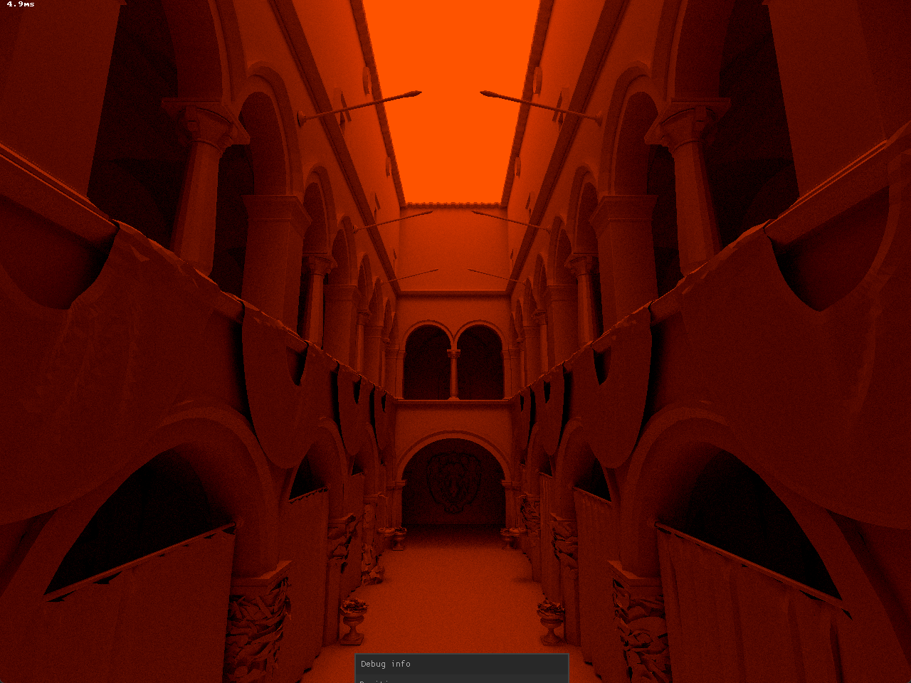

# Kingfisher

> [!IMPORTANT]
> Kingfisher is a work in progress project.

Kingfisher is a spectral path tracer.
This means that it simulates light as having different wavelengths instead of using RGB like is commonly done.
Goal for the project is to have a path tracer that can accurately simulate phenomena for which knowing the wavelength is necessary, such as dispersion, and learning Vulkan to use hardware-accelerated ray tracing.
Then I also want to make it go fast of course :)

Originally, I started the project with the idea of only using the CPU to trace and use SIMD to make it go fast.
In its current state it uses multithreading (1 thread per logical core) to trace a BVH build with Embree. 

You can fly around with WASD, up and down with QE, faster holding Shift, and look around with the arrow keys.
The screenshot is after standing still for a while and letting the samples accumulate.
The scene is the Sponza scene illuminated from outside with light with a wavelength of 120nm.

## Dependencies

Kingfisher uses the following libraries:

- SDL3 for platform support and window creation
- nuklear to create UI
- embree for BVH building
- fast_obj.h to load .obj files
- ufbx to load .fbx files
- splitmix64 and xoshiro128plus for PRNG
- cglm for vector math
